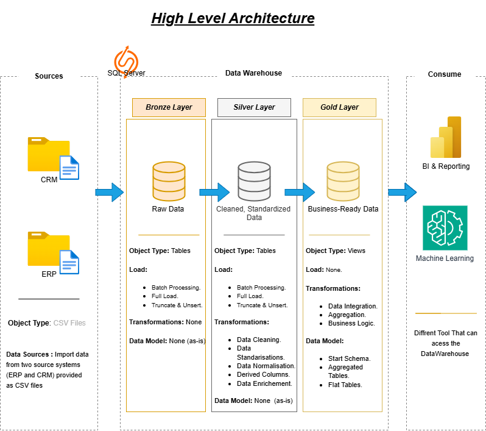

# 🚀 SQL Data Warehouse Project
Welcome to my End-to-End Data Warehouse Project repository!

## 📌 Overview

This project demonstrates the design and implementation of a modern **SQL-based Data Warehouse** using the **Medallion Architecture (Bronze → Silver → Gold)**.

The goal of this project was to gain hands-on experience in:

* Data warehousing concepts
* ETL pipeline design
* Data cleaning & transformation
* Star schema modeling
* Writing production-style SQL

This project was developed by following a guided data engineering tutorial. I implemented each layer step-by-step to deeply understand medallion architecture, ETL design, and data modeling concepts.

---

# 🏗️ Architecture



The warehouse follows a layered design:

## 🥉 Bronze Layer – Raw Data

* Loads CSV files into SQL Server
* Uses `BULK INSERT`
* Applies **full reload strategy (TRUNCATE + INSERT)**
* Designed to be **idempotent** (safe to re-run without duplicating data)
* No transformations applied

## 🥈 Silver Layer – Cleaned & Structured Data

* Deduplication using `ROW_NUMBER()`
* Window functions (`LEAD`) for date validation
* Filtering invalid records
* Null handling
* Standardizing categorical values
* Enforcing business rules

## 🥇 Gold Layer – Analytics Model

* Star schema design
* Fact and dimension tables
* Optimized for analytical queries
* Ready for BI tools

---

# 🔄 ETL Strategy

### ✔ Full Reload (Idempotent Design)

Each run:

1. `TRUNCATE` target tables
2. Re-load and transform data
3. Rebuild analytics tables

This ensures:

* No duplicate records
* Consistent results
* Easy debugging during development

---

# 📊 Skills Demonstrated

* SQL Development (T-SQL)
* Data Modeling (Star Schema)
* ETL Pipeline Design
* Data Cleaning Techniques
* Data Validation & Filtering
* Schema Organization (Bronze/Silver/Gold)
* Analytical Query Writing

---

# 🛠️ Tech Stack

* SQL Server Express
* SQL Server Management Studio (SSMS)
* T-SQL
* CSV Data Sources
* Git & GitHub

---

# 📂 Repository Structure

```
data-warehouse-project/
│
├── datasets/                  # Raw CSV files (ERP & CRM)
│
├── docs/
│   ├── data_architecture.png
│   ├── data_model.png
│   ├── data_flow.png
│   ├── data_catalog.md
│
├── scripts/
│   ├── bronze/                # Raw ingestion scripts
│   ├── silver/                # Cleaning & transformation logic
│   ├── gold/                  # Star schema & analytics tables
│
├── README.md
└── .gitignore
```

---

# 🎯 What I Learned

* Why raw data should never be transformed directly
* The importance of idempotent ETL design
* How to separate ingestion from transformation
* How to enforce data quality rules
* How dimensional modeling improves analytics performance
* The difference between full reload and incremental load strategies

---

# 🚀 Next Steps (Planned Improvements)

* Implement incremental loading using `MERGE`
* Add surrogate keys
* Introduce logging & monitoring tables
* Connect to Power BI for reporting
* Add basic data quality tests

---

# 👨‍💻 Why This Project Matters

This project represents my practical understanding of:

* How data flows from raw files to analytics
* How to structure a warehouse professionally
* How to write clean and repeatable SQL transformations
---
# 👨‍💻 About Me

I built this project as part of my journey into Data Engineering and Analytics Engineering.
Feel free to connect with me on LinkedIn and explore the repository!
📬 Contact
<p align="left">
  <a href="https://www.linkedin.com/in/el-ghalbouni-oumaima-a73a26331/" target="_blank">
    
  </a>
  
  <a href="mailto:elghalbouniomaima@gmail.com">
    
  </a>
</p>
