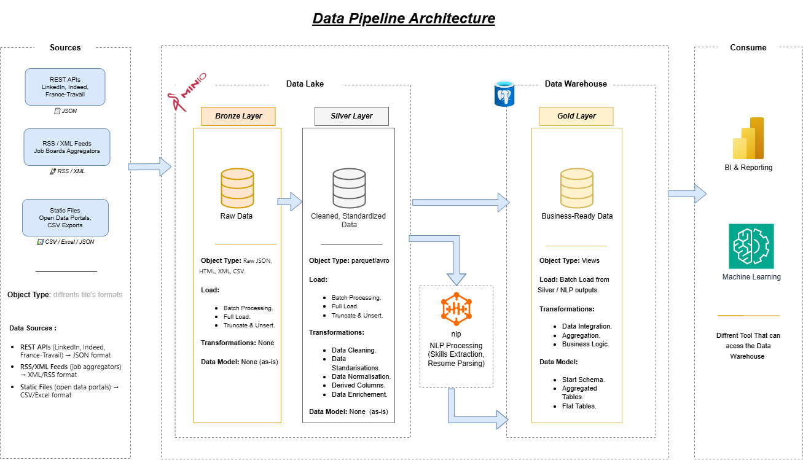
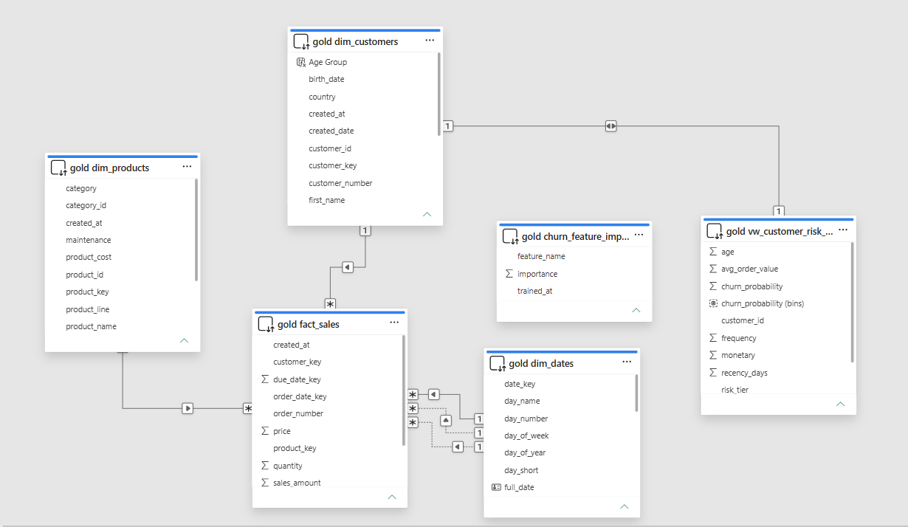

# 🚀 End-to-End Data Warehouse & Customer Analytics Platform

An end-to-end data engineering and analytics project that transforms raw sales and customer data into a structured **Data Warehouse**, an analytical **Gold Layer**, interactive **Power BI dashboards**, and a **Machine Learning churn prediction pipeline**.

The project demonstrates the complete journey from raw data ingestion and transformation to business intelligence and predictive analytics.

---

## 📌 Table of Contents

- [Project Overview](#-project-overview)
- [Business Objectives](#-business-objectives)
- [Architecture](#-architecture)
- [Technology Stack](#-technology-stack)
- [Data Warehouse](#-data-warehouse)
- [Gold Layer](#-gold-layer)
- [Machine Learning - Customer Churn Prediction](#-machine-learning---customer-churn-prediction)
- [Power BI Analytics](#-power-bi-analytics)
- [Project Structure](#-project-structure)
- [Data Flow](#-data-flow)
- [Key Metrics](#-key-metrics)
- [Machine Learning Results](#-machine-learning-results)
- [Setup and Installation](#-setup-and-installation)
- [Running the Project](#-running-the-project)
- [Power BI Connection](#-power-bi-connection)
- [Screenshots](#-screenshots)
- [Future Improvements](#-future-improvements)
- [Key Learnings](#-key-learnings)
- [Author](#-author)

---

# 📊 Project Overview

This project implements an end-to-end data platform designed to support both **descriptive analytics** and **predictive analytics**.

The project starts with raw business data and progressively transforms it into structured analytical datasets.

The final platform provides:

- A structured SQL Data Warehouse
- Bronze, Silver, and Gold data layers
- A dimensional Star Schema
- Customer, product, sales, and date dimensions
- Business intelligence dashboards using Power BI
- Customer segmentation and sales analytics
- Customer churn prediction using Machine Learning
- Customer risk scoring
- Feature importance analysis
- A "Customers at Risk" analytical dashboard

The overall workflow is:

```text
                    ┌─────────────────────┐
                    │     Raw Sources     │
                    │ Customer / Product  │
                    │ Sales Data           │
                    └──────────┬──────────┘
                               │
                               ▼
                    ┌─────────────────────┐
                    │   Bronze Layer      │
                    │ Raw / Initial Data  │
                    └──────────┬──────────┘
                               │
                               ▼
                    ┌─────────────────────┐
                    │   Silver Layer      │
                    │ Cleaning &          │
                    │ Transformation      │
                    └──────────┬──────────┘
                               │
                               ▼
                    ┌─────────────────────┐
                    │    Gold Layer       │
                    │ Dimensional Model  │
                    └──────────┬──────────┘
                               │
                 ┌─────────────┴─────────────┐
                 ▼                           ▼
        ┌─────────────────┐        ┌────────────────────┐
        │    Power BI     │        │ Machine Learning   │
        │    Analytics    │        │ Churn Prediction   │
        └────────┬────────┘        └─────────┬──────────┘
                 │                           │
                 ▼                           ▼
        ┌─────────────────┐        ┌────────────────────┐
        │ Business        │        │ Customer Risk      │
        │ Dashboards      │        │ Predictions        │
        └─────────────────┘        └────────────────────┘
````

---

# 🎯 Business Objectives

The main objective is to transform transactional data into useful business insights and predictive intelligence.

The project answers questions such as:

### Customer Analytics

* How many customers do we have?
* What is the average customer age?
* Which countries generate the most customers?
* What percentage of customers are male/female?
* How many new customers joined during a given period?
* How many customers make repeat purchases?
* How many orders does each customer make on average?

### Sales Analytics

* What is the total sales amount?
* Which products generate the most revenue?
* Which product lines perform best?
* How does sales performance evolve over time?
* Which countries generate the highest sales?

### Product Analytics

* Which products generate the highest revenue?
* Which product lines perform best?
* How are products distributed across categories?
* Which products have the highest sales volume?

### Customer Churn

* Which customers are likely to churn?
* What percentage of customers are at risk?
* Which customers have the highest churn probability?
* What behavioral characteristics are associated with churn?
* Which countries have the highest concentration of at-risk customers?

---

# 🏗️ Architecture



The project follows a layered Data Warehouse architecture.

```text
                    DATA SOURCES
                         │
                         ▼
                ┌─────────────────┐
                │  Bronze Layer   │
                │ Raw Data        │
                └────────┬────────┘
                         │
                         ▼
                ┌─────────────────┐
                │  Silver Layer   │
                │ Cleaned Data    │
                │ Standardization │
                └────────┬────────┘
                         │
                         ▼
                ┌─────────────────┐
                │   Gold Layer    │
                │ Star Schema     │
                └────────┬────────┘
                         │
             ┌───────────┴───────────┐
             │                       │
             ▼                       ▼
      ┌─────────────┐        ┌─────────────────┐
      │   Power BI  │        │ Machine Learning│
      │ Dashboards  │        │ Churn Prediction│
      └─────────────┘        └────────┬────────┘
                                      │
                                      ▼
                           ┌─────────────────────┐
                           │ Customer Risk Data  │
                           └─────────────────────┘
```


---

# 🛠️ Technology Stack

## Data Engineering

* SQL Server
* T-SQL
* Data Warehouse
* Dimensional Modeling
* Star Schema
* ETL / ELT concepts

## Data Analysis

* Python
* Pandas
* NumPy
* Matplotlib
* Scikit-learn

## Machine Learning

* Logistic Regression
* Random Forest
* Gradient Boosting
* XGBoost
* Cross-validation
* Hyperparameter tuning
* Feature importance
* Churn probability prediction

## Business Intelligence

* Microsoft Power BI
* DAX
* Interactive dashboards
* Data modeling
* Time-series analysis
* Conditional formatting
* Geographic analysis

## Development Tools

* Git
* GitHub
* VS Code
* Jupyter Notebook

---

# 🏢 Data Warehouse


The Data Warehouse is organized into multiple layers to separate raw data from analytical data.

## Bronze Layer

The Bronze layer contains the initial/raw representation of the source data.

The main objective is to preserve the source information before applying extensive transformations.

---

## Silver Layer

The Silver layer is responsible for cleaning and standardizing the data.

Typical transformations include:

* Data type corrections
* Cleaning missing values
* Standardizing categorical values
* Removing inconsistencies
* Data validation
* Preparing data for analytical modeling

---

## 🥇 Gold Layer

The Gold layer contains business-ready analytical tables.

It follows a **dimensional modeling approach** using a Star Schema.

The main tables are:

```text
gold.dim_customers
gold.dim_products
gold.dim_dates
gold.fact_sales
```

Additional tables support the Machine Learning workflow:

```text
gold.customer_churn_training
gold.customer_churn_scoring
gold.customer_churn_predictions
gold.churn_feature_importance
```

---

# 🧩 Power BI Semantic Model

The Power BI report is built directly on the Gold layer star schema, with one addition — a `vw_customer_risk_detail` view joining the churn prediction tables together for the "Customers at Risk" page.




### Tables

| Table | Role | Key |
|---|---|---|
| `gold.dim_customers` | Dimension | `customer_key` (surrogate) |
| `gold.dim_products` | Dimension | `product_key` (surrogate) |
| `gold.dim_dates` | Dimension | `date_key` (surrogate) |
| `gold.fact_sales` | Fact | `customer_key`, `product_key`, `order_date_key`, `due_date_key` (foreign keys) |
| `gold.vw_customer_risk_detail` | Extension view | `customer_id`, joined to `dim_customers` |
| `gold.churn_feature_importance` | Reference table | standalone, no relationships — feeds the feature-importance chart only |

### A design detail worth knowing: the role-playing date dimension

`fact_sales` links to `dim_dates` **twice** — once via `order_date_key`, once via `due_date_key` (a shipping date key exists too but isn't shown active here). This is a **role-playing dimension**: the same physical date table serving multiple logical purposes (order date vs. due date) without duplicating all that calendar logic twice.

Power BI only allows **one active relationship** between any two tables at a time — the rest are created as *inactive* (shown as dashed lines in the model view). To use an inactive relationship in a measure, it has to be explicitly activated with `USERELATIONSHIP()`, for example:

```dax
Orders by Due Date =
CALCULATE(
    [Total Orders],
    USERELATIONSHIP(fact_sales[due_date_key], dim_dates[date_key])
)
```

Without this, any visual using the due date would silently fall back to the order date relationship instead — a subtle bug worth understanding rather than tripping over.

---

# 🤖 Machine Learning: Churn Prediction

To extend the warehouse beyond reporting, I built a churn prediction pipeline directly on top of the Gold layer — treating it as a feature store for downstream data science work, not just a BI endpoint.

### The Problem
This dataset has no subscription or cancellation event, so churn had to be defined behaviorally: a customer is "churned" if they don't return to buy within a data-driven window. Rather than guessing a threshold, I measured actual reorder gaps across the customer base (median ~255 days, p90 ~702 days) and cross-checked that against the total history available in the data before settling on a **365-day window** — long enough to be meaningful, short enough to be statistically supportable given the data's span.

### Avoiding Label Leakage
The most common mistake in churn modeling: using "days since last order" both to define the churn label *and* as a model feature, which lets the model trivially rediscover its own label instead of learning anything. I used a **time-based snapshot split** instead — features are computed from data before a snapshot date, and the label is based on whether the customer actually returned to buy in the window *after* it, making this a genuine forward-looking prediction rather than a restated definition.

### Features
`recency_days`, `frequency`, `monetary`, `avg_order_value`, `tenure_days`, `age`, plus `gender`/`marital_status`/`country` (one-hot encoded). Behavioral features (`recency_days`, `tenure_days`) dominate the model's decisions; value features remain important for prioritizing *which* at-risk customers to act on first, even though they don't predict churn strongly on their own.

### Model Comparison

Two classifiers were trained and evaluated on the same leakage-free,
time-split training data, both balanced for the ~16%/84% churn split:

| Metric | Random Forest | Gradient Boosting |
|---|---:|---:|
| Accuracy | 95% | 94% |
| ROC-AUC | 0.984 | 0.983 |
| Churn Precision | 76% | 75% |
| Churn Recall | 97% | 86% |
| Churn F1-score | 85% | 82% |

*(Note: figures pending a final re-run on corrected country data — see
open follow-ups in the case study.)*

The two models perform almost identically, which is itself a useful
finding: it indicates the engineered features — not the choice of
algorithm — are what's driving performance. **Random Forest was shipped
as the primary model**, chosen for its simplicity, native class-imbalance
handling (`class_weight="balanced"`, vs. Gradient Boosting requiring a
manual `sample_weight` workaround), and easier explainability to a
non-technical stakeholder.

The model is used to:

- Predict the probability of customer churn
- Classify customers into **Low**, **Medium**, and **High** risk tiers (percentile-based, not fixed thresholds — see case study for why)
- Identify the main features associated with churn
- Store predictions back in the Gold layer


The predictions are stored in:

```text
gold.customer_churn_predictions
```

Full reasoning, every diagnostic query, and the bugs caught along the way
are documented in
[`ml/customer_churn/docs/churn_prediction_case_study.md`](ml/customer_churn/docs/churn_prediction_case_study.md).
---

# 📊 Power BI Analytics

Power BI is connected to the Gold layer and Machine Learning prediction tables.

The report contains several analytical pages.

---

## 1. 👥 Customer Overview

The Customer page provides an overview of the customer base.


Main KPIs include:

* Total Customers
* Average Customer Age
* Most Common Customer Country
* Male Customer Percentage
* Female Customer Percentage
* New Customers
* Repeat Purchase Rate
* Orders per Customer

Visualizations include:

* Customers Over Time
* Customers by Country
* Customer Demographics
* Customer Insights
* Customer Purchase Behavior

---

## 2. 📦 Product Analytics

The Product page focuses on product performance.


Key visualizations include:

* Sales by Product
* Sales by Product Line
* Sales by Category
* Top Products
* Product Performance
* Product Distribution

A Treemap is used to visualize sales contribution by product line.

---

## 3. 💰 Sales Analytics

The Sales page provides an overview of sales performance.


Key metrics include:

* Total Sales
* Total Orders
* Average Order Value
* Total Quantity
* Sales by Gender
* Sales by Product Line
* Sales Trends


---

## 5. 📈 Trends & Insights

The Trends page focuses on changes over time.


Examples include:

* Sales over time
* Customer growth
* New customers over time
* Orders over time
* Monthly trends
* Yearly comparisons

The `dim_dates` table is used to support time-based filtering and analysis.

---

## 6. 🚨 Customers at Risk

The Customers at Risk page combines Machine Learning predictions with Power BI analytics.

The page is designed to help identify customers who may require proactive retention actions.


Main KPIs:

```text
Total Customers
At Risk Customers
High Risk Customers
Average Churn Probability
Customers to Recover
```

Main visualizations:

### Customers by Risk Tier

Shows the distribution of:

```text
Low Risk
Medium Risk
High Risk
```
### At Risk Customers by Country

Shows geographic distribution of customers with elevated churn risk.

### Churn Probability Distribution

Shows how predicted churn probabilities are distributed across customers.

### Top Risk Factors

Shows the most important features influencing the churn model.

### Top High-Risk Customers

A table showing customers with the highest churn probabilities.

Example:

| Customer ID | Country | Churn Probability | Risk |
| ----------- | ------- | ----------------: | ---- |
| CUST_1023   | Morocco |              0.92 | High |
| CUST_5098   | Morocco |              0.91 | High |
| CUST_2045   | France  |              0.89 | High |

---


# 🖥️ Interactive Demo App

To take the churn model beyond a one-off script, I built a small full-stack layer on top of the warehouse: a **FastAPI** service that serves the trained model and precomputed predictions, and a **Streamlit** app that consumes it. This gives the project a live, operational use case alongside the Power BI dashboard — Power BI answers *"how is the business doing overall,"* this app answers *"is this specific customer at risk, right now."*

**Stack:** FastAPI (model serving + batch prediction API) → Streamlit (interactive front end) → SQL Server Gold layer + scikit-learn model

### 🔍 Customer Lookup

Looks up a customer by ID and returns their most recent churn prediction (probability + risk tier) from the batch scoring pipeline.

### 📋 At-Risk Watchlist

A live, filterable list of customers flagged as churn risks, sorted by revenue at stake — the same data behind the "Customers at Risk" Power BI page, but interactive and queryable on demand.

### 🧪 Live What-If Predictor

Runs the trained model directly on hypothetical customer inputs and returns an instant churn probability — real-time inference, not precomputed batch results.

---

# 🔄 End-to-End Data Flow

The complete workflow is:

```text
1. Raw Data
      │
      ▼
2. Bronze Layer
      │
      ▼
3. Silver Layer
      │
      ▼
4. Gold Dimensional Model
      │
      ├───────────────┐
      │               │
      ▼               ▼
5. Power BI       5. Churn Feature
   Analytics          Engineering
                          │
                          ▼
                    6. Training Dataset
                          │
                          ▼
                    7. ML Model Training
                          │
                          ▼
                    8. Customer Scoring
                          │
                          ▼
                    9. Churn Predictions
                          │
                          ▼
                    10. Power BI
                        Customers at Risk
```

---

# 📁 Project Structure

The repository is organized as follows:

```text
End-to-End-Data-Warehouse-with-SQL/
│
├── README.md
│
├── data/
│   └── ...
│
├── docs/
│   └── images/
│       ├── architecture.png
│       ├── gold-layer-model.png
│       ├── customer-dashboard.png
│       ├── product-dashboard.png
│       ├── sales-dashboard.png
│       ├── geography-dashboard.png
│       ├── trends-dashboard.png
│       └── customers-at-risk.png
│
├── scripts/
│   │
│   ├── bronze/
│   │   └── ...
│   │
│   ├── silver/
│   │   └── ...
│   │
│   └── gold/
│       └── ...
│
├── ml/
│   │
│   ├── notebooks/
│   │   ├── ...
│   │
│   ├── model/
│   │   └── churn_model.joblib
│   │
│   └── src/
│       └── ...
│
├── report/powerbi/
│   ├── Customer_Analytics.pbix
│   └── screenshots/
│
└── requirements.txt
```

---

# 📌 Key Metrics

Some of the main business metrics implemented in Power BI include:

### Total Customers

```DAX
Total Customers =
DISTINCTCOUNT(dim_customers[customer_key])
```

### Total Sales

```DAX
Total Sales =
SUM(fact_sales[sales_amount])
```

### Total Orders

```DAX
Total Orders =
DISTINCTCOUNT(fact_sales[order_number])
```

### Average Order Value

```DAX
Average Order Value =
DIVIDE(
    [Total Sales],
    [Total Orders]
)
```

### Orders per Customer

```DAX
Orders per Customer =
DIVIDE(
    [Total Orders],
    [Total Customers]
)
```

Other DAX measures are used for:

* New Customers
* Repeat Customers
* Repeat Purchase Rate
* Customer growth
* Average customer age
* Gender distribution
* Geographic analysis
* Churn risk analysis

---


# ⚙️ Setup and Installation

## 1. Clone the repository

```bash
git clone <YOUR_GITHUB_REPOSITORY_URL>
cd End-to-End-Data-Warehouse-with-SQL
```

---

## 2. Create a Python virtual environment

```bash
python -m venv .venv
```

Activate it on Windows:

```bash
.venv\Scripts\activate
```

---

## 3. Install dependencies

```bash
pip install -r requirements.txt
```

Or:

```bash
pip install pandas numpy scikit-learn sqlalchemy pyodbc joblib xgboost matplotlib seaborn jupyter
```

---

# 🗄️ SQL Server Setup

The project uses SQL Server as the Data Warehouse.

Before running the scripts:

1. Install SQL Server.
2. Create the required database.
3. Create the Bronze, Silver, and Gold schemas.
4. Execute the SQL scripts in the correct order.

Recommended execution order:

```text
1. Database initialization
        ↓
2. Bronze tables
        ↓
3. Silver tables
        ↓
4. Gold dimensions
        ↓
5. Gold fact tables
        ↓
6. Date dimension
        ↓
7. Churn training/scoring tables
        ↓
8. Churn prediction tables
```

---

# 🤖 Running the Churn Pipeline

The churn workflow has two stages: SQL feature engineering, then a single
Python script that handles training, evaluation, and scoring together.

### Step 1 — Build the training and scoring datasets

```sql
EXEC gold.build_churn_training_data;
EXEC gold.build_churn_scoring_data;
```

`build_churn_training_data` computes features as of a snapshot date and
labels each customer using a forward-looking window (avoiding label
leakage — see the [case study](ml/customer_churn/docs/churn_prediction_case_study.md)
for the full reasoning). `build_churn_scoring_data` computes the same
features as of today, with no label, ready to be scored.

### Step 2 — Train, evaluate, and score in one run

```bash
python ml/customer_churn/src/train_and_score_churn.py
```

This single script:

1. Loads `gold.customer_churn_training`
2. Splits into train/test (stratified on the churn label)
3. Preprocesses numerical and categorical features via a scikit-learn `Pipeline`
4. Trains the classifier
5. Evaluates it (classification report, ROC-AUC, confusion matrix)
6. Saves feature importances to `gold.churn_feature_importance`
7. Saves the trained model to `ml/customer_churn/model/churn_model.joblib`
8. Loads `gold.customer_churn_scoring`, scores every current customer
9. Assigns percentile-based risk tiers (Low / Medium / High)
10. Writes predictions to `gold.customer_churn_predictions`

### Step 3 — Serve predictions via API (optional)

```bash
uvicorn ml.customer_churn.api.main:app --reload
```

Exposes batch predictions (`/customers/{id}/risk`, `/customers/at-risk`)
and a live scoring endpoint (`/predict`) that runs the saved model
directly on new input, without touching the warehouse. Interactive docs
at `http://127.0.0.1:8000/docs`.

### Step 4 — Run the demo app (optional)

```bash
streamlit run ml/customer_churn/app/app.py
```

Requires the API from Step 3 to already be running.

---

# 🔌 Power BI Connection

Power BI connects directly to the SQL Server Gold layer.

The main analytical tables are:

```text
gold.dim_customers
gold.dim_products
gold.dim_dates
gold.fact_sales
```

The churn dashboard additionally uses:

```text
gold.customer_churn_predictions
gold.churn_feature_importance
```

This allows Power BI to display the latest Machine Learning predictions alongside business data.

---

# 🖼️ Screenshots

## Gold Layer Data Model


The Gold layer follows a dimensional model where:

* Customers describe customers
* Products describe products
* Dates describe time
* Sales contain transactional measures

---

## Customer Analytics


The Customer Analytics page provides insights into:

* Customer growth
* Customer demographics
* Customers by country
* Repeat purchases
* Customer behavior

---

## Product Analytics


The Product page analyzes:

* Sales by product
* Sales by product line
* Product categories
* Top-performing products

---

## Sales Analytics


The Sales page focuses on:

* Total sales
* Sales trends
* Sales by gender
* Sales by product line
* Order performance

---

## Geography


The Geography page provides a geographic view of customers and sales.

---

## Trends & Insights


The Trends page provides time-based analysis of customer and sales behavior.

---

## Customers at Risk


The Customers at Risk dashboard combines Machine Learning predictions with business intelligence.

It helps identify:

* High-risk customers
* Medium-risk customers
* Low-risk customers
* Churn probability
* Geographic risk
* Risk factors
* Customers requiring retention actions

---

# 🚀 Future Improvements

Potential improvements include:

### Data Engineering

* Automate ETL pipelines
* Add orchestration with Apache Airflow
* Implement pipeline monitoring
* Add automated testing

### Machine Learning

* Hyperparameter tuning using GridSearchCV
* RandomizedSearchCV for larger parameter spaces
* Feature engineering
* Model explainability using SHAP
* Model versioning
* Automated model retraining
* Threshold optimization based on business costs

### Churn Analytics

* Historical prediction tracking
* Churn probability trends per customer
* Customer retention recommendations
* Automated alerts for high-risk customers
* Customer lifetime value prediction
---

# 💡 Key Learnings

This project provided practical experience with:

### Data Engineering

* Data Warehouse architecture
* ETL/ELT pipelines
* Layered data architecture
* Dimensional modeling
* Star Schema
* Surrogate keys
* Fact and dimension tables
* Date dimensions
* SQL Server

### Data Analytics

* SQL analytical queries
* DAX
* KPI design
* Time-series analysis
* Customer segmentation
* Geographic analysis

### Machine Learning

* Feature engineering
* Data preprocessing
* Classification
* Cross-validation
* Model evaluation
* Hyperparameter tuning
* Churn prediction
* Feature importance

### Business Intelligence

* Power BI data modeling
* Interactive dashboards
* Conditional formatting
* KPI cards
* Funnel analysis
* Geographic visualization
* Risk dashboards

---

# 🏁 Conclusion

This project demonstrates an end-to-end approach to building a modern analytical data platform.

The workflow combines:

```text
Data Engineering
       +
Data Warehousing
       +
Business Intelligence
       +
Machine Learning
       =
End-to-End Analytics Platform
```

The final solution transforms raw transactional data into actionable business insights and predictive customer intelligence.

The Machine Learning component extends traditional BI by allowing the business to identify customers who are potentially at risk of churn and prioritize them for proactive retention actions.

---

# 👩‍💻 Author

**Oumaima El Ghalbouni**

Data Engineering Student

Interested in:

* Data Engineering
* Data Science
* Machine Learning
* Big Data
* Business Intelligenc

---

## ⭐ If you found this project interesting

Feel free to explore the repository and the different components of the data platform.

````
