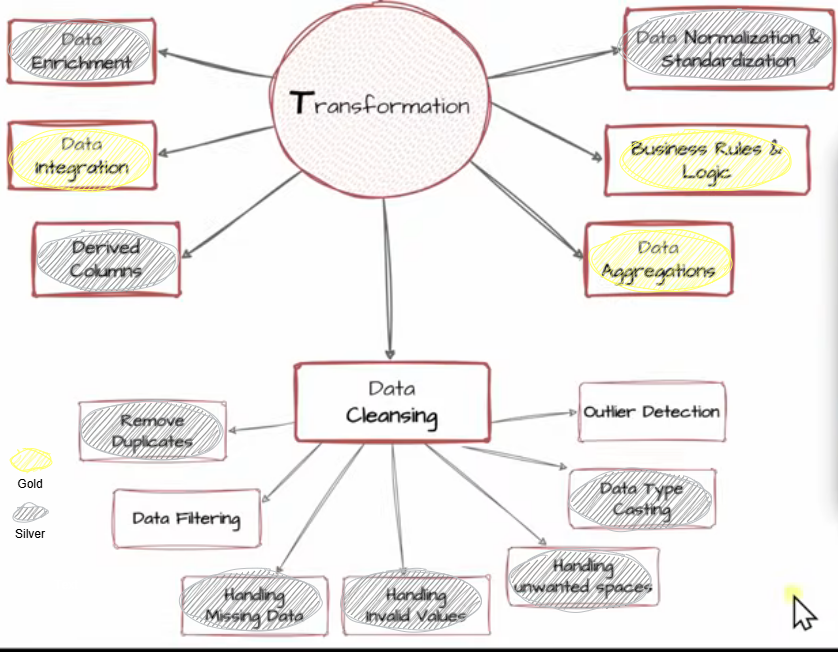
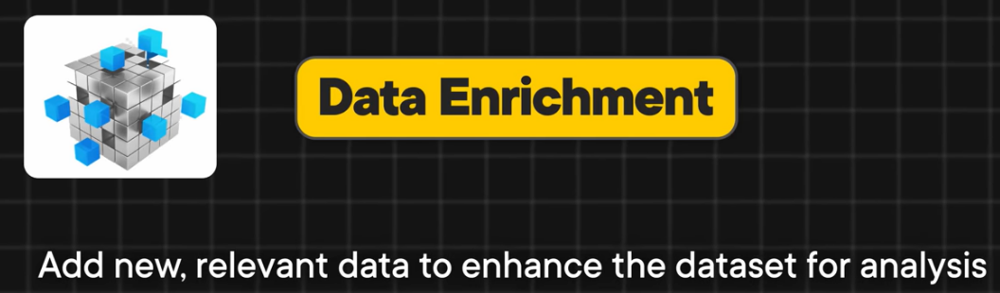

# 🎯 What Is Idempotency?

**Idempotency** means:

## 🏆 Professional Definition

If asked in interview:

> What is idempotency in ETL?

Answer:

> Idempotency ensures that running a pipeline multiple times produces the same result without duplication or data corruption. It is often achieved using truncate-and-load or merge strategies.

---

### 🎯 In Your Project

Using:

```sql
TRUNCATE TABLE silver.table_name;
INSERT INTO silver.table_name ...
```

No duplicates.
No corruption.
No unexpected changes.

---

## 📦 Simple Example

If your pipeline:

1. Truncates table
2. Inserts fresh transformed data

Then every run produces:

✔ Same rows
✔ Same counts
✔ Same result

That pipeline is **idempotent**.
---
# 🔹 1️⃣ What “full reload” means

In your project, you are doing:

```sql
TRUNCATE TABLE silver.table_name;

INSERT INTO silver.table_name
SELECT ...
FROM bronze.table_name;
```

That means:

* Delete everything
* Recalculate everything
* Insert everything again

This is called a **full reload**.

It is:

* Simple
* Clean
* Idempotent
* Perfect for learning projects

---

# 🔹 2️⃣ Why full reload is NOT ideal in production

Imagine:

* Table has 500 million rows
* Only 1,000 new rows arrive today

With full reload:

You delete 500M rows
Then reinsert 500M rows

That is:

❌ Slow
❌ Expensive
❌ Heavy on the server
❌ Not scalable

---

# 🔹 3️⃣ What “incremental loading” means

Instead of rebuilding everything:

You only process:

* New rows
* Updated rows

That’s called **incremental loading**.

Example:

* Insert rows that don’t exist
* Update rows that changed
* Leave the rest untouched

Much faster. Much smarter.

---

# 🔹 4️⃣ What is “MERGE-based upsert”?

In **Microsoft SQL Server**, you can use:

```sql
MERGE target_table AS target
USING source_table AS source
ON target.id = source.id

WHEN MATCHED THEN
    UPDATE SET target.name = source.name

WHEN NOT MATCHED THEN
    INSERT (id, name)
    VALUES (source.id, source.name);
```

This does:

* UPDATE if row exists
* INSERT if row does not exist

This is called an **upsert** (update + insert).

That is incremental loading.

---

# 🔹 5️⃣ What “scalability” means here

Scalability = the system still works efficiently when data grows.

Full reload:

* OK for 10k rows
* Problematic for 500M rows

Incremental:

* Works even for billions of rows

That’s why production systems use incremental strategies.

---

Very good question 👌 — this is fundamental in data engineering and data science.

---
# Data Transformations:

## 🎯 What Is Data Filtering (as a Data Cleaning Technique)?

### 🎓 Interview-Ready Definition

If asked:

> What is data filtering in data cleaning?

You can answer:

> Data filtering is the process of selecting only records that meet predefined quality or business rules, while excluding invalid, irrelevant, or inconsistent data to improve dataset reliability.

## 🎯Data Enrichment:



## 🎯Derived Columns:

